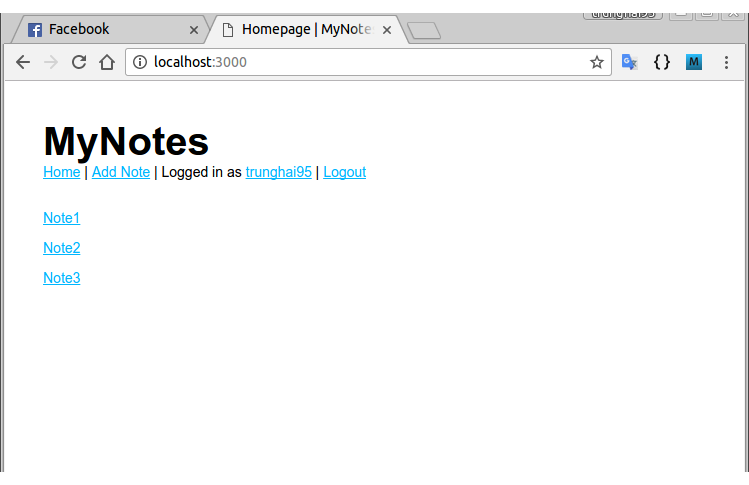

# Notes

- A simple web application for noting, based on the [Node.js tutorial on PhoCode](http://phocode.com/javascript/nodejs-lap-trinh-web-voi-node-js/) (Vietnamese).
- Built on __Node.js__ (using __Express.js__ framework).
- __SQLite3__, __MongoDB__ or __MySQL__ for database.

## Screenshots

*Index page*

*Adding a new note*

*Viewing a note*

*Index page after adding the note*

*Deleting a note*

## Changelog 29/01/2017

- Refine source code (a little bit!).
- Add __MySQL__ for database.
- Can choose between SQLite3 and MongoDB by setting the `database` field in *config.json*
  - `sqlite3` for SQLite3
  - `mongodb` for MongoDB
  - `mysql` for MySQL
- Fix noteview (multiline notes are now really multiline!).
- Add demo screenshots.

## Changelog 27/01/2017

- Add __MongoDB__ for database.
- Can choose between SQLite3 and MongoDB by setting the `database` field in *config.json* (`sqlite3` for SQLite3 and `mongodb` for MongoDB).
