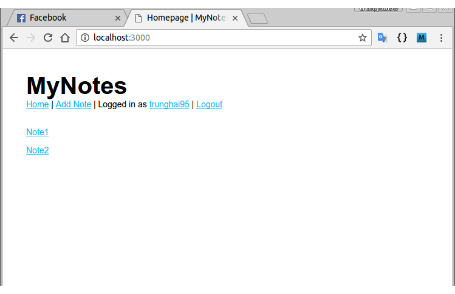

# MyNotes

- A simple web application for taking notes, based on the [Node.js tutorial on PhoCode](http://phocode.com/javascript/nodejs-lap-trinh-web-voi-node-js/) (Vietnamese).
- Built on __Node.js__ (using __Express.js__ framework).
- __MySQL__ for database.
- __Passport.js__ for user authentication.

## Screenshots

*Log in*

*Register*

*Index page*

*Account info*

*Adding a new note*

*Viewing a note*

*Index page after adding the note*

*Deleting a note*

### Changelog 08/02/2017

- Add user registration.
- Fix some minor bugs.

### Changelog 06/02/2017

- Complete models.
- Add __Passport.js__ for user authentication.
- TODO: Add registration.

### Changelog 04/02/2017

- Deprecate __SQLite3__ and __MongoDB__ database.
- Reconstruct the __MySQL__ models.
- TODO: Add source code for users model, fix the routes layer.

### Changelog 29/01/2017

- Refine source code (a little bit!).
- Add __MySQL__ for database.
- Can choose between SQLite3 and MongoDB by setting the `database` field in *config.json*
  - `sqlite3` for SQLite3
  - `mongodb` for MongoDB
  - `mysql` for MySQL
- Fix noteview (multiline notes are now really multiline!).
- Add demo screenshots.

### Changelog 27/01/2017

- Add __MongoDB__ for database.
- Can choose between SQLite3 and MongoDB by setting the `database` field in *config.json* (`sqlite3` for SQLite3 and `mongodb` for MongoDB).
